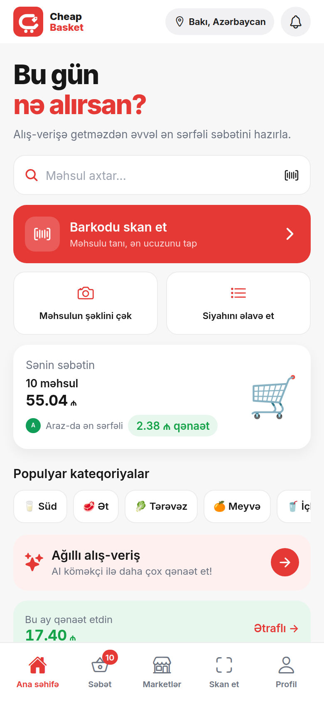
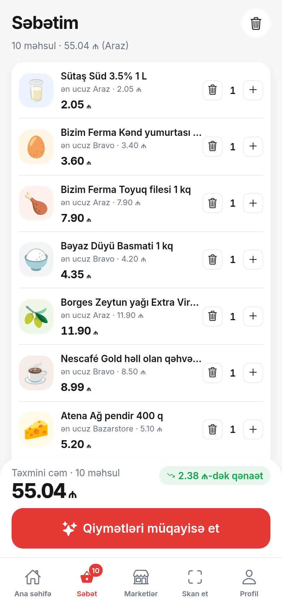
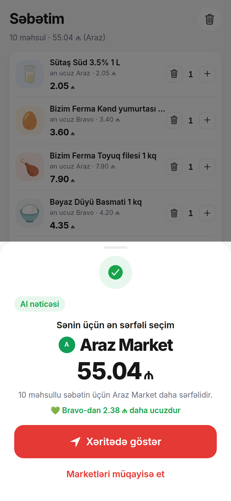
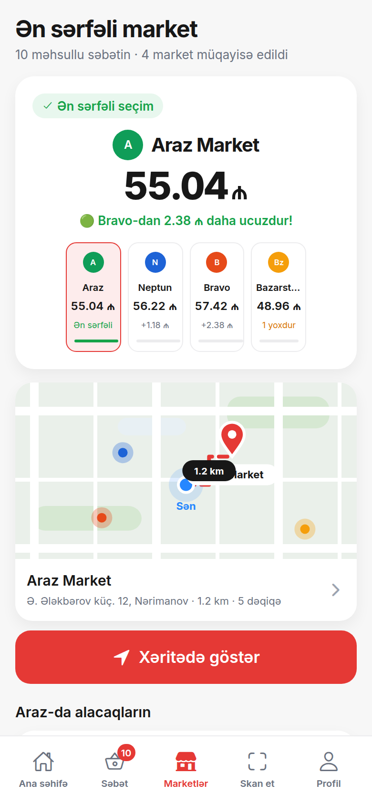
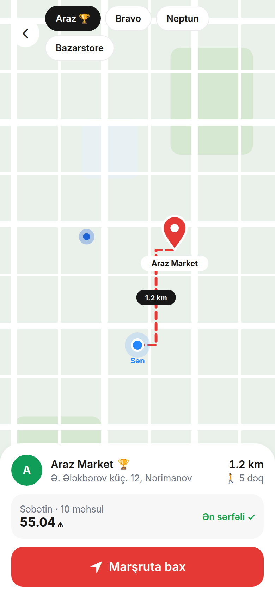
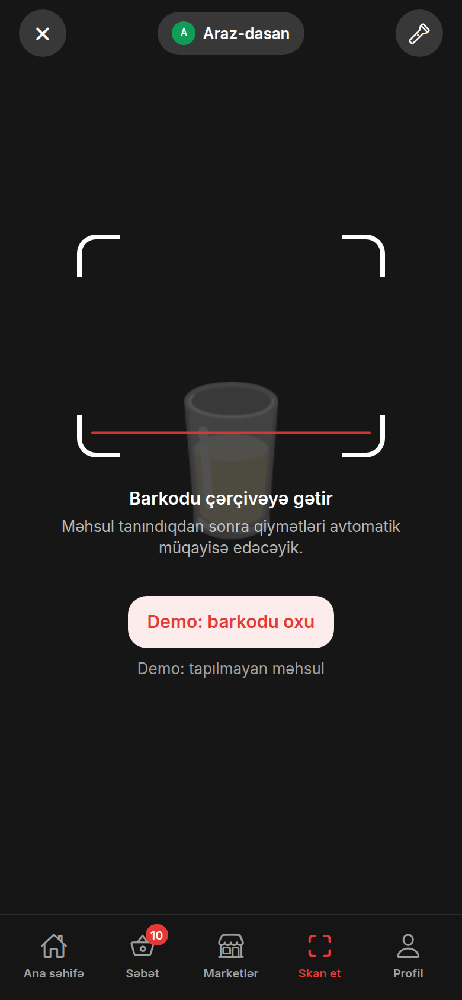
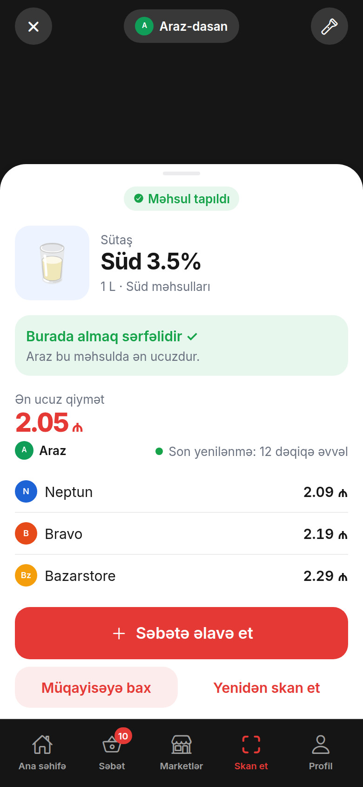
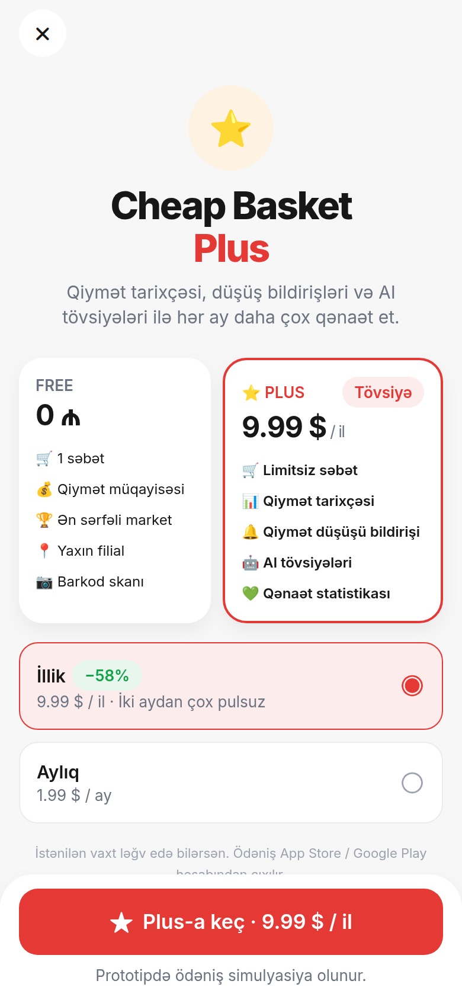

# Cheap Basket — AI Shopping Comparison App

> **Səbətini yarat. Ən sərfəli marketi tap. Get və al.** 🛒
> Scan · Compare · Save

Azərbaycan üçün mobil tətbiq: istifadəçi əvvəlcədən səbətini yığır, AI hansı marketin **bütün səbət üçün** ən sərfəli olduğunu deyir və ən yaxın filialı xəritədə göstərir. Barkod skanı marketin içində əlavə üstünlükdür.

Bu repo **Expo (React Native) + TypeScript** ilə yazılmış klikləmə prototipidir: iOS, Android və Web-də eyni koddan işləyir. Dizayn `design/cheap-basket-app.zip` faylındakı Next.js mockup-a uyğunlaşdırılıb.

| Ana səhifə | Səbət | AI nəticəsi | Marketlər |
|---|---|---|---|
|  |  |  |  |

| Xəritə | Skan | Məhsul tapıldı | Plus |
|---|---|---|---|
|  |  |  |  |

## Əsas flow

```
Ana səhifə → Məhsul əlavə et → Səbət (10 məhsul) → "Qiymətləri müqayisə et"
→ 🤖 AI nəticəsi: "Sənin üçün ən sərfəli seçim Araz-dır · 55.04 ₼ · Bravo-dan 2.38 ₼ ucuz"
→ Marketlər: bütün marketlərin cəmi (istifadəçi özü də seçə bilər) + ən yaxın filial
→ Xəritə: Sən → 1.2 km → Araz Market → "Marşruta bax"
```

Marketin içində: **Skan et** → məhsul tanınır → qiymətlər müqayisə olunur → *"Burada almaq sərfəlidir ✓"* və ya *"Neptun-da 0.10 ₼ ucuzdur"* → Səbətə əlavə et.

## Ekranlar

| Route | Ekran | Vəziyyətlər |
|---|---|---|
| `/` | Ana səhifə — başlıq, axtarış (inline nəticə), qırmızı skan kartı, səbət xülasəsi, kateqoriyalar, AI banner | loading, "Məhsul tapılmadı" |
| `/search` | Siyahını əlavə et — son axtarışlar, populyar, bütün məhsullar | loading skeleton, boş nəticə |
| `/basket` | Səbətim — miqdar, sil, "Məhsul əlavə et", sticky CTA | boş səbət |
| `/basket` → sheet | AI nəticəsi (bottom sheet) | analiz animasiyası → nəticə |
| `/markets` | Ən sərfəli market — hero, 4 market cəmi, mini xəritə, alış siyahısı | boş səbət, "1 məhsul yoxdur" |
| `/map?store=araz` | Tam ekran xəritə, filial seçimi, "Marşruta bax" (Google Maps) | boş səbət |
| `/scan?mode=barcode\|photo` | Kamera (expo-camera), çərçivə, "Araz-dasan" konteksti | axtarılır, tapıldı, tapılmadı, mövcud deyil |
| `/product/[id]` | Qiymət müqayisəsi, təzəlik, tarixçə (Plus), AI alternativ (Plus) | məhsul yoxdur, heç bir marketdə yoxdur |
| `/assistant` | AI köməkçi (Plus) — "50 manatlıq səbət", alternativlər, "hamısını səbətə əlavə et" | typing |
| `/savings` | Qənaət (Plus) — bu ay 17.40 ₼, həftəlik qrafik, tarixçə | lock |
| `/plus` | Free vs Plus, aylıq / illik, simulyasiya olunan alış | aktiv / qeyri-aktiv |
| `/profile` | Profil — Plus kartı, qənaət, ayarlar siyahısı | — |

### Free vs Plus

| FREE — 0 ₼ | ⭐ PLUS — 1.99 $ / ay · 9.99 $ / il |
|---|---|
| 🛒 1 səbət | 🛒 Limitsiz səbət |
| 💰 Qiymət müqayisəsi | 📊 Qiymət tarixçəsi |
| 🏆 Ən sərfəli market | 🔔 Qiymət düşüşü bildirişi |
| 📍 Yaxın filial | 🤖 AI tövsiyələri |
| 📷 Barkod skanı | 💚 Qənaət statistikası |

Plus funksiyaları `PlusLock` komponenti ilə bağlanır; prototipdə "Plus-a keç" düyməsi alışı simulyasiya edir.

## İşə salmaq

```bash
npm install
npm start          # Expo Go / simulator (i = iOS, a = Android, w = web)
npm run web        # brauzerdə (desktop-da telefon çərçivəsində göstərilir)
npm run typecheck  # tsc --noEmit
```

Web prototipi (statik):

```bash
npm run export:web   # → dist/
```

### Vercel-ə yükləmək

Next.js lazım deyil — Expo web export statik saytdır. Repo-nu Vercel-ə import et; `vercel.json` build əmrini (`npx expo export --platform web`), output qovluğunu (`dist`) və SPA rewrite-ı artıq təyin edir. Framework preset: **Other**.

## Struktur

```
app/                    # expo-router ekranları
  _layout.tsx           # Inter font, BasketProvider, stack
  (tabs)/               # index · basket · markets · scan · profile
  product/[id].tsx  search.tsx  map.tsx  assistant.tsx  savings.tsx  plus.tsx
src/
  theme.ts              # rənglər (#E53935 accent), 8-pt grid, Inter tipografiya
  data/products.ts      # 18 məhsul, 4 market (Araz, Bravo, Neptun, Bazarstore), filiallar
  data/plans.ts         # Free / Plus
  lib/optimizer.ts      # səbət → hər market üzrə cəm, ən sərfəli market, qənaət
  lib/assistant.ts      # AI köməkçi cavabları (mock)
  store/basket.tsx      # səbət + plan konteksti
  components/           # ui primitivləri, ProductRow, MiniMap, ResultSheet, PlusLock, TabBar
assets/                 # app icon, adaptive icon, splash (SVG mənbələri assets/brand/)
design/                 # orijinal dizayn mockup-u (Next.js)
```

## Növbəti addımlar (istehsal üçün)

- Real məhsul/qiymət API-si və barkod bazası (`src/data/products.ts` əvəzinə)
- `react-native-maps` + `expo-location` (`MiniMap` eyni pin/label-ları saxlayır)
- Şəkil ilə tanıma (`/scan?mode=photo`) üçün vision modeli
- AI köməkçi üçün real LLM backend (`src/lib/assistant.ts` interfeysi hazırdır)
- Ödəniş: RevenueCat / StoreKit / Google Play Billing (`plan` state-i əvəzinə)
- Push bildirişləri (qiymət düşüşü) — `expo-notifications`
